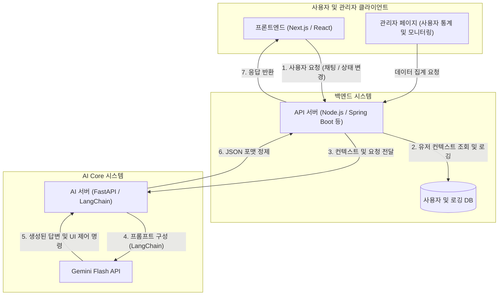

# AI 헬스케어 프로젝트 아키텍처 및 기술 스택 가이드

이 문서는 AI 에이전트 동작 흐름을 바탕으로 실제 프로덕션 수준의 앱을 개발하기 위한 전체 아키텍처, 기술 스택, 그리고 각 파트(프론트엔드, 백엔드, AI) 엔지니어가 프로젝트 전 과정에서 수행해야 할 상세한 역할과 업무를 정의합니다.

---

## 🏗️ 1. 전체 시스템 아키텍처 (System Architecture)

전체 시스템은 크게 3개의 파트로 나뉘며, API를 통해 데이터를 주고받습니다.

---

## 🛠️ 2. 확정된 핵심 기술 스택

프로젝트 요구사항에 따라 확정된 프레임워크와 모델은 다음과 같습니다.

* **프론트엔드 (Frontend)**: **React + Next.js** (SSR/SSG 성능 최적화, 최신 App Router 기반 라우팅 관리)
* **AI 백엔드 (AI Core)**: **LangChain + Gemini Flash** (빠른 추론 속도와 최적화된 비용의 최신 지능형 모델 활용)
* **서비스 백엔드 (Backend)**: Node.js (Express/NestJS) 또는 Spring Boot (데이터베이스 연결, 인증, 회원/상태 관리 전담)

---

## 🎯 3. 엔지니어별 상세 역할 및 프로젝트 수행 가이드

프로젝트 기획부터 개발, 배포, 유지보수(운영)까지 각 엔지니어가 책임져야 할 세밀한 역할 분담입니다.

### 📱 A. 프론트엔드 (Frontend) 엔지니어
**[목표] 사용자 경험(UX) 극대화, Next.js를 활용한 빠르고 SEO 최적화된 앱 및 관리자 뷰 구현**

1. **기획 및 디자인 단계**
   * 피그마(Figma) 등 UI/UX 디자인을 바탕으로 Next.js 컴포넌트 단위(Atomic Design) 분리 계획 수립
   * 전역 상태 관리(Zustand, Redux, Jotai 등) 아키텍처 및 폴더 구조 설계
2. **초기 세팅 및 메인 개발 단계**
   * Next.js 프로젝트 설정 및 UI 라이브러리(Tailwind CSS, Radix UI 등) 환경 세팅
   * **사용자 앱 구현:** 챗봇 UI, 문진표 폼, 대시보드(건강 리포트 시각화), 인터랙티브 애니메이션(Framer Motion 등 활용)
   * **관리자 페이지(Admin) 구현:** 사내 및 운영진 전용 대시보드 (가입자 수, 활성 사용자, AI 응답 오류율 등 차트 시각화)
3. **API 연동 및 동적 UI 제어 단계**
   * 백엔드에서 전달받은 AI 응답 JSON (텍스트 답변 vs `ui_update` 제어 명령)을 파싱하여 화면 상태(테마 다크모드 변경, 특정 비디오/위젯 마운트 등)를 동적으로 제어
   * API 통신 지연 시 스켈레톤 UI, 로딩 스피너 등을 적용해 자연스러운 UX 보장
4. **테스트 및 모니터링 (운영 단계)**
   * 브라우저 호환성 및 모바일 반응형 디바이스별 테스트 진행
   * 프론트엔드 에러 트래킹 도구(Sentry 등) 연동으로 클라이언트 사이드 런타임 에러 모니터링
   * Core Web Vitals 최적화(이미지 렌더링 최적화, 폰트 로드 최적화)

### ⚙️ B. 백엔드 (Backend) 엔지니어
**[목표] 안정적인 데이터/트래픽 제어, 확장 가능한 DB 설계, 보안 및 비즈니스 로직 담당**

1. **기획 및 DB 설계 단계**
   * 관계형 DB(PostgreSQL/MySQL) 설계 및 ERD 작성 (User, HealthData, ChatHistory, Admin 등)
   * 보안 요구사항 적용 (JWT 기반 인증, OAuth 토큰 관리, 민감한 헬스 데이터 비식별화/암호화)
2. **API 서버 구현 단계**
   * 회원가입/로그인 (인증/인가 로직) 엔드포인트 구현
   * API Gateway 역할 수행: 앱에서 요청 시 DB의 "사용자 상태 정보"를 꺼내어, "채팅 메시지"와 묶어서 AI 서버(FastAPI)로 던져주고 결과를 다시 앱으로 중계
   * 관리자 페이지 전용 통계 추출 API 개발 (기간별 유입량, AI 요청 건수, 오류 횟수 등)
3. **로깅 및 예외(에러) 시스템 구축**
   * 서버 요청/응답 이력을 로깅 시스템(Datadog, ELK 스택, CloudWatch 등)에 적재하여 이슈 추적 기반 마련
   * AI 서버 타임아웃/장애 발생 시 무한 로딩을 막기 위한 재시도(Retry) 알고리즘 및 기본 응답(Fallback) 로직 구현
4. **인프라 및 서버 배포**
   * AWS, GCP 혹은 온프레미스 환경에 Docker 기반 배포 파이프라인(CI/CD) 구축 (GitHub Actions 활용 등)
   * 서버 리소스 (CPU, Memory, DB 커넥션 풀) 현황 모니터링

### 🧠 C. AI (AI Core) 엔지니어
**[목표] Gemini Flash와 LangChain을 조합한 정확하고, 빠르며, 제어 가능한(JSON) AI 파이프라인 구축**

1. **프롬프트 엔지니어링 및 LangChain 파이프라인 설계**
   * LangChain을 이용해 프롬프트 체인(Chain) 설계: `입력 (대화 이력 + DB 유저 상태 + 현재 발화)` ➡️ `프롬프트 템플릿` ➡️ `Gemini Flash` ➡️ `Output Parser`
   * 시스템 프롬프트 작성: AI가 환각(Hallucination) 없이 건강 관련 보수적 조언만 하도록 역할 및 한계(Guardrails) 정의
   * **구조화된 출력(Structured Output) 튜닝:** LLM이 어떠한 상황에서도 약속된 JSON 포맷(`action_type`, `ui_components` 등)으로만 답하도록 프롬프트 및 파서 정밀 튜닝
2. **AI 마이크로서비스 (FastAPI) 개발**
   * Python FastAPI 환경을 세팅하여 백엔드 서버에서 호출할 REST API 엔드포인트(/api/v1/generate 등) 구축
   * Gemini API Key 등 기밀 정보 환경변수 안전 관리
3. **성능 및 비용 최적화**
   * 유저 경험(UX) 개선을 위해 답변이 나오는 즉시 타자 치듯 화면에 뿌려주는 Streaming 전송 방식 도입 검토
   * LangSmith 등 LangChain 생태계 도구와 연동하여 AI 내부 추론 로직(Trace) 분석 빛 디버깅
   * Gemini Flash 토큰 사용량 모니터링 및 로깅을 통한 비용 추산 리포팅
4. **테스트 및 개선 (운영 단계)**
   * 악의적인 프롬프트 인젝션(Prompt Injection) 방어 및 엣지 케이스 필터링 로직 추가
   * 프로덕션에서 발생한 "AI 오답 로그"를 수집하여 주기적으로 프롬프트 개선 및 버전 관리

---

## 🔄 4. 파트 간의 실무 협업 시나리오 (예시: 신규 기능 추가)

**상황:** "스트레스가 높다고 말하는 사용자에게, 명상 비디오와 함께 '날씨'에 어울리는 조언 텍스트를 제공하자"

1. **Backend:** 공공 날씨 API 등을 연동하여 사용자의 현재 위치 기반 날씨를 가져와 DB(혹은 캐시) 상태에 포함시킨다.
2. **AI:** Backend에게 _"앞으로 사용자 정보 넘겨줄 때 `weather_condition` 필드도 같이 던져주세요"_ 라고 요청한 뒤, 프롬프트 템플릿에 `[현재 날씨가 맑으면 야외 산책 권유, 흐리면 실내 명상 권유 로직 반영]`을 추가한다.
3. **Frontend:** AI가 내려주는 JSON 포맷의 `ui_components.theme` 에 `rainy_mood` 값 등이 추가로 올 수 있음을 전달받고, 해당 값이 올 때 배경화면과 명상 컨트롤러 UI가 변하는 코드를 작성한다.
4. **Admin (공통):** 프론트는 "관리자용 기능 통계 페이지"에 날씨 기반 추천이 얼마나 실행되었는지 그리는 차트 UI를 추가하고, 백엔드는 로그에서 해당 건수를 그룹핑해 반환하는 집계 API를 붙여준다.
