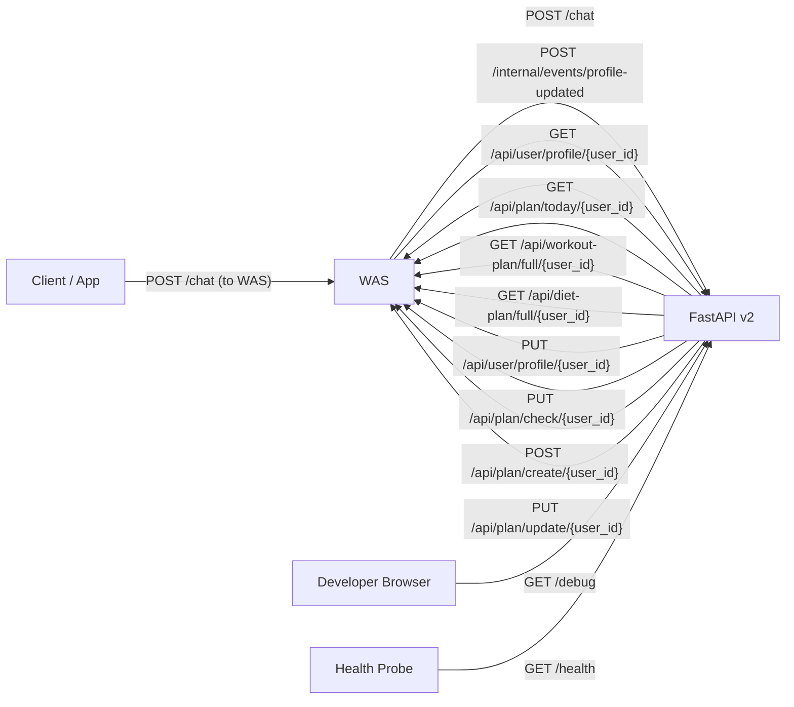
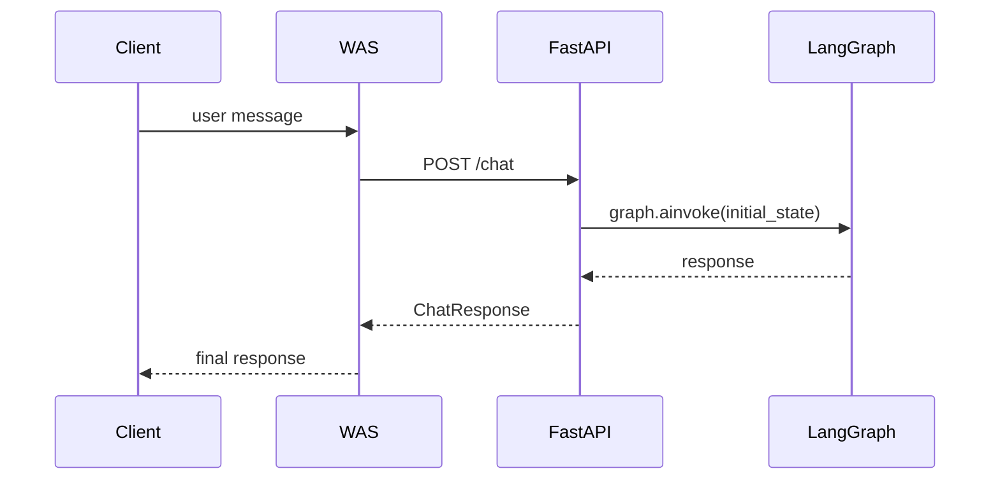
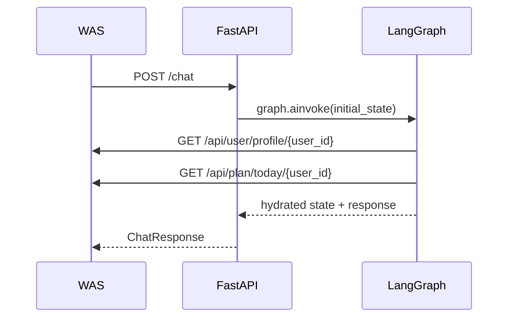
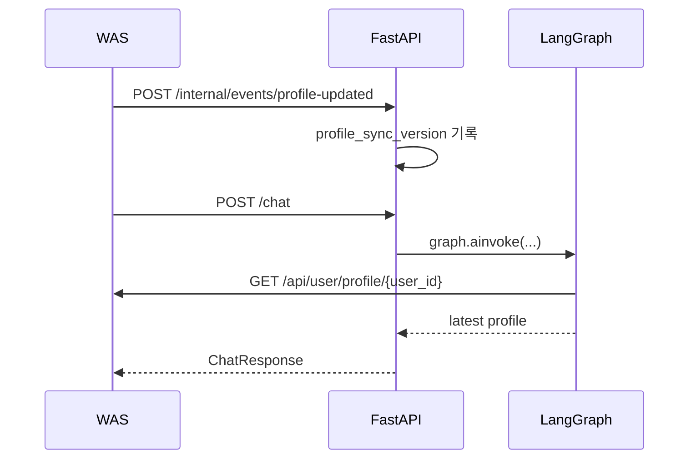
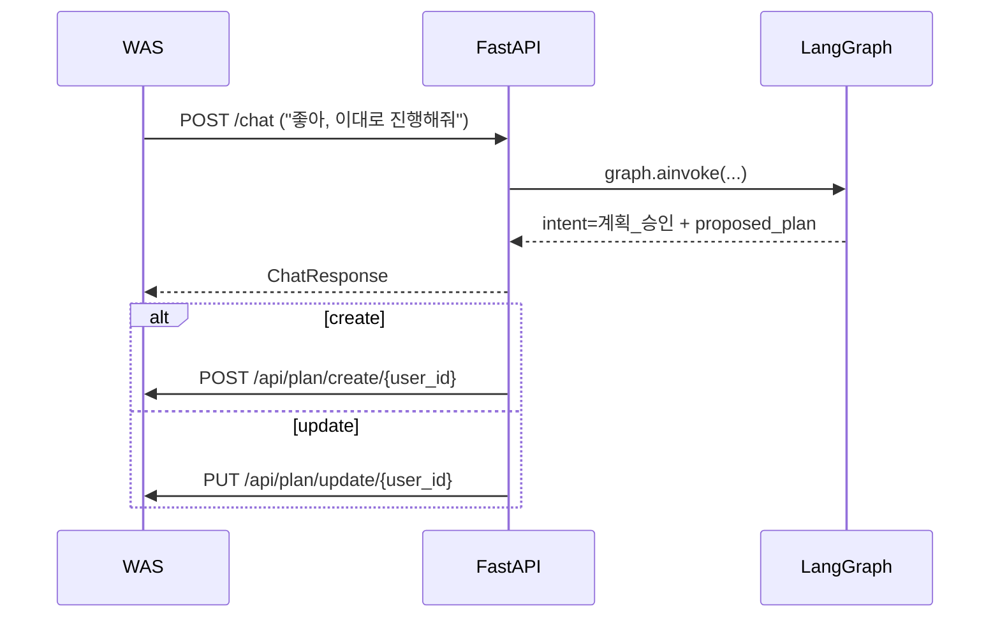

# v2 API Specification

이 문서는 `ai-model/v2` 기준의 HTTP 통신을 한눈에 보기 쉽게 정리한 문서입니다.

관련 문서:
- [was_api_contract.md](/C:/Users/ksh00/anti_projects/capstone_2team/develop/ai-model/v2/docs/was_api_contract.md)
- [profile_sync_flow.md](/C:/Users/ksh00/anti_projects/capstone_2team/develop/ai-model/v2/docs/profile_sync_flow.md)
- [v2_model_analysis.md](/C:/Users/ksh00/anti_projects/capstone_2team/develop/ai-model/v2/docs/v2_model_analysis.md)

## 1. 한눈에 보는 REST 통신



## 2. FastAPI로 들어오는 HTTP

| 구분 | Method | Path | Caller | 설명 |
|---|---|---|---|---|
| Main API | `POST` | `/chat` | WAS | WAS가 사용자 메시지를 전달하는 메인 엔드포인트 |
| Public API | `GET` | `/health` | Health probe / dev | 서버 상태 확인 |
| Dev UI | `GET` | `/debug` | Developer Browser | 디버그 테스트 UI |
| Internal Event | `POST` | `/internal/events/profile-updated` | WAS | 프로필 변경 이벤트 push |

## 3. FastAPI가 호출하는 WAS HTTP

| Method | Path | 호출 시점 | 설명 |
|---|---|---|---|
| `GET` | `/api/user/profile/{user_id}` | 첫 세션 또는 profile refresh 필요 시 | 사용자 프로필 조회 |
| `GET` | `/api/plan/today/{user_id}` | 첫 세션 | 오늘 플랜 조회 |
| `GET` | `/api/workout-plan/full/{user_id}` | 운동 계획 수정 시 | 전체 운동 플랜 조회 |
| `GET` | `/api/diet-plan/full/{user_id}` | 식단 계획 수정 시 | 전체 식단 플랜 조회 |
| `PUT` | `/api/user/profile/{user_id}` | 기록/프로필 수정 저장 시 | 프로필 변경 반영 |
| `PUT` | `/api/plan/check/{user_id}` | 오늘 플랜 완료 체크 시 | 플랜 완료 반영 |
| `POST` | `/api/plan/create/{user_id}` | 계획 승인 create 시 | 새 계획 생성 |
| `PUT` | `/api/plan/update/{user_id}` | 계획 승인 update 시 | 기존 계획 수정 |

## 4. 대표 시퀀스

### 4.1 일반 채팅



### 4.2 첫 턴 로드



### 4.3 프로필 변경 후 다음 턴 반영



### 4.4 계획 승인 저장



## 5. FastAPI 엔드포인트 상세

## 5.1 `POST /chat`

WAS가 사용자 메시지를 전달하는 메인 엔드포인트입니다.

### Request Body

| 필드 | 타입 | 필수 | 설명 |
|---|---|---:|---|
| `user_id` | `string` | O | 사용자 ID |
| `user_message` | `string` | O | 사용자 메시지 |
| `session_id` | `string` | X | 세션 ID. 없으면 FastAPI가 생성 |
| `user_profile_override` | `object` | X | 개발/디버그용 override |

### Request Example

```json
{
  "user_id": "tester_001",
  "user_message": "이번 주 주 4회 운동 계획 짜줘",
  "session_id": "chat-session-001"
}
```

첫 요청이라면 `session_id` 없이 보내도 됩니다.

```json
{
  "user_id": "tester_001",
  "user_message": "안녕"
}
```

### Response Body

| 필드 | 타입 | 설명 |
|---|---|---|
| `status` | `string` | 기본값 `success` |
| `session_id` | `string` | 현재 세션 id |
| `response` | `string` | 사용자 응답 |
| `intent` | `string \| null` | 분류된 intent |
| `emotion` | `object \| null` | 감정 분석 결과 |
| `draft_response` | `string \| null` | Draft preview |
| `debug_state` | `object \| null` | 개발용 디버그 정보 |

### Important

- `session_id`가 없으면 FastAPI가 자동 생성합니다.
- FastAPI가 생성한 `session_id`는 응답으로 돌아오므로, WAS가 저장해서 다음 턴에 재사용하면 됩니다.

## 5.2 `GET /health`

간단한 상태 확인 엔드포인트입니다.

### Response Example

```json
{
  "status": "ok",
  "env": "production",
  "version": "v2"
}
```

## 5.3 `GET /debug`

개발자용 디버그 UI입니다.

주요 기능:
- user_profile override
- persona 선택
- 테스트 예제 문장
- draft/debug_state 확인

## 5.4 `POST /internal/events/profile-updated`

WAS가 프로필 변경 사실을 FastAPI에 push하는 내부 이벤트 엔드포인트입니다.

### Request Example

```json
{
  "user_id": "tester_001",
  "changed_fields": ["selected_ai_persona"],
  "profile_version": 7
}
```

### Response Example

```json
{
  "status": "success",
  "user_id": "tester_001",
  "tracked_version": 7
}
```
