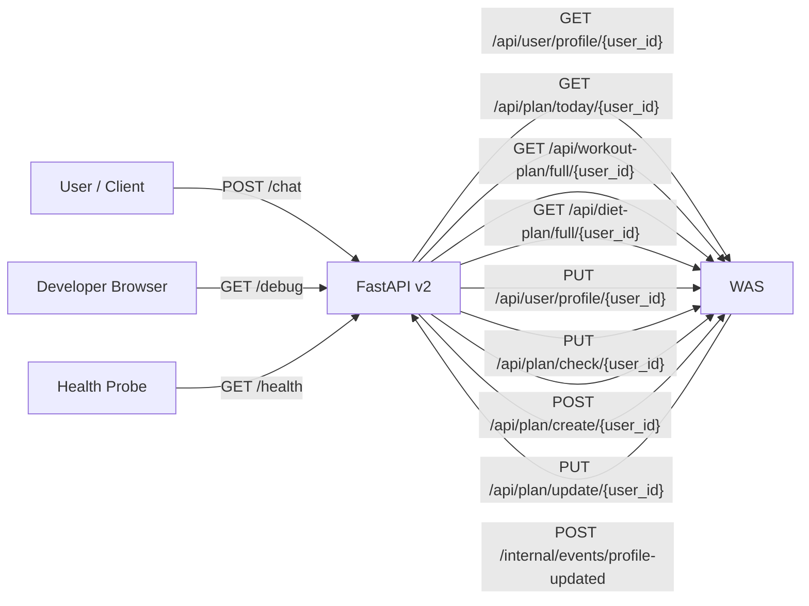
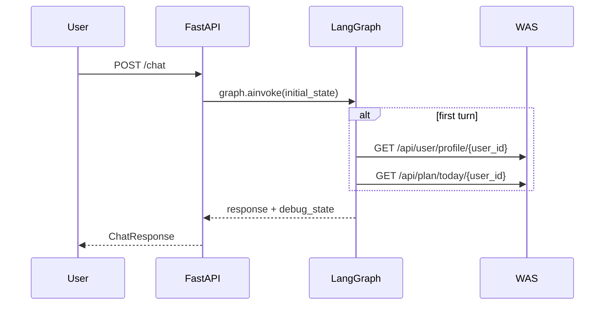
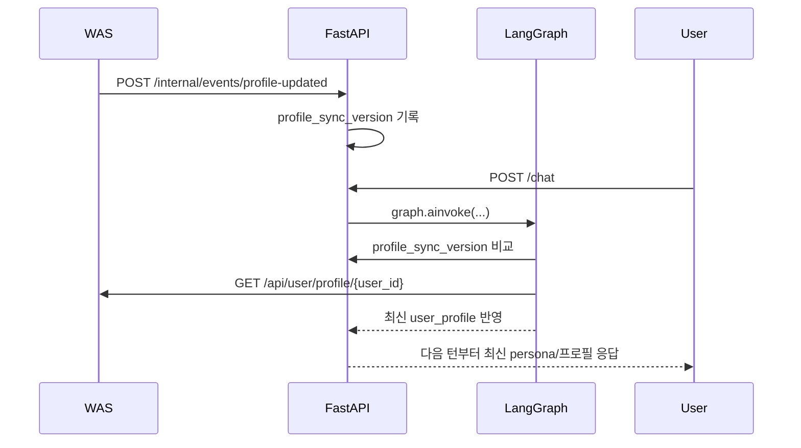
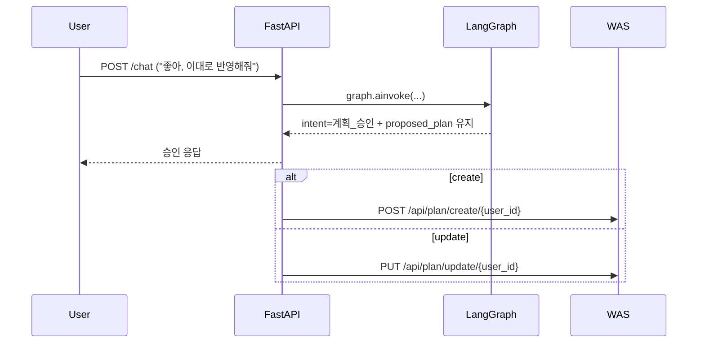

# v2 API 명세

이 문서는 `ai-model/v2` 기준의 HTTP 통신을 한눈에 보기 쉽게 정리한 문서입니다.

관련 문서:
- `docs/was_api_contract.md`
- `docs/profile_sync_flow.md`
- `docs/v2_model_analysis.md`

## 1. 한눈에 보는 REST 통신



### 1.1 FastAPI로 들어오는 HTTP

| 구분 | Method | Path | Caller | 설명 |
|---|---|---|---|---|
| Public API | `POST` | `/chat` | User / App Client | 메인 대화 엔드포인트 |
| Public API | `GET` | `/health` | Health probe / dev | 서버 상태 확인 |
| Dev UI | `GET` | `/debug` | Developer Browser | 내부 디버그 테스트 UI |
| Internal Event | `POST` | `/internal/events/profile-updated` | WAS | 프로필 변경 이벤트 push |

### 1.2 FastAPI가 호출하는 WAS HTTP

| Method | Path | 호출 시점 | 설명 |
|---|---|---|---|
| `GET` | `/api/user/profile/{user_id}` | 세션 첫 턴, profile refresh 필요 시 | 사용자 프로필 조회 |
| `GET` | `/api/plan/today/{user_id}` | 세션 첫 턴 | 오늘 플랜 조회 |
| `GET` | `/api/workout-plan/full/{user_id}` | 수정 intent에서 운동 계획 수정 시 | 전체 운동 계획 조회 |
| `GET` | `/api/diet-plan/full/{user_id}` | 수정 intent에서 식단 계획 수정 시 | 전체 식단 계획 조회 |
| `PUT` | `/api/user/profile/{user_id}` | 기록/프로필 수정 저장 시 | 프로필 변경 반영 |
| `PUT` | `/api/plan/check/{user_id}` | 체크 완료 저장 시 | 오늘 플랜 완료 반영 |
| `POST` | `/api/plan/create/{user_id}` | 계획 승인 후 create 시 | 새 계획 생성 |
| `PUT` | `/api/plan/update/{user_id}` | 계획 승인 후 update 시 | 기존 계획 수정 |

## 2. 핵심 시퀀스

### 2.1 일반 채팅



### 2.2 프로필 변경 후 다음 턴 반영



### 2.3 계획 승인 저장



## 3. FastAPI 인바운드 엔드포인트

### 3.1 `POST /chat`

메인 대화 엔드포인트입니다. LangGraph를 실행하고 최종 응답을 반환합니다.

#### Request Body

| 필드 | 타입 | 필수 | 설명 |
|---|---|---:|---|
| `user_id` | `string` | O | 사용자 ID |
| `user_message` | `string` | O | 이번 턴 사용자 입력 |
| `session_id` | `string` | X | LangGraph checkpoint thread id |
| `user_profile_override` | `object` | X | 개발/디버그용 임시 프로필 override |

#### Request 예시

```json
{
  "user_id": "tester_001",
  "user_message": "이번 주 주 4회 운동 계획 짜줘",
  "session_id": "a3d8f5d3-7b43-4d83-8ac4-4a3d2b91a201",
  "user_profile_override": {
    "selected_ai_persona": "warm",
    "goal": "fat_loss",
    "activity_level": "moderate"
  }
}
```

#### Response Body

| 필드 | 타입 | 설명 |
|---|---|---|
| `status` | `string` | 기본값 `success` |
| `session_id` | `string` | 현재 세션 id |
| `response` | `string` | 최종 사용자 응답 |
| `intent` | `string \| null` | 분류된 intent |
| `emotion` | `object \| null` | 감정 분석 결과 |
| `draft_response` | `string \| null` | Draft preview |
| `debug_state` | `object \| null` | 개발 환경에서만 노출되는 디버그 정보 |

#### `debug_state` 주요 필드

| 필드 | 설명 |
|---|---|
| `search_results_count` | 검색 결과 수 |
| `search_quality` | `ok` 또는 `degraded` |
| `draft_components` | 구조화된 Draft 계약 결과 |
| `proposed_plan_count` | 승인 대기 계획 수 |
| `selected_ai_persona` | 현재 프로필의 persona 값 |
| `resolved_persona_id` | registry fallback 적용 후 실제 사용된 persona |
| `profile_sync_version` | 현재 세션이 반영 중인 프로필 버전 |
| `intimacy_level` | 현재 친밀도 값 |

#### Response 예시

```json
{
  "status": "success",
  "session_id": "a3d8f5d3-7b43-4d83-8ac4-4a3d2b91a201",
  "response": "이번 주는 주 4회 기준으로 상체/하체 분할로 가면 좋겠습니다. 회복을 위해 하루 휴식도 중간에 넣을게요. 이 방향으로 계획 제안할까요?",
  "intent": "계획",
  "emotion": {
    "label": "중립",
    "intensity": 0.2
  },
  "draft_response": "이번 주는 주 4회 분할이 적절하다.\n\n이유:\n- 회복일을 포함하면 지속 가능성이 높다.\n- 분할 훈련으로 부위별 볼륨을 배분하기 쉽다.\n\n제안: 상체/하체 기준의 주 4회 루틴을 제안한다.\n\n이 방향으로 계획 제안할까요?",
  "debug_state": {
    "search_results_count": 3,
    "search_quality": "ok",
    "draft_components": {
      "core_message": "이번 주는 주 4회 분할이 적절하다.",
      "reason_points": [
        "회복일을 포함하면 지속 가능성이 높다.",
        "분할 훈련으로 부위별 볼륨을 배분하기 쉽다."
      ],
      "suggested_action": "상체/하체 기준의 주 4회 루틴을 제안한다.",
      "safety_notes": [],
      "approval_question": "이 방향으로 계획 제안할까요?",
      "search_grounding_summary": "검색 결과 중 핵심 근거만 요약했다."
    },
    "proposed_plan_count": 4,
    "selected_ai_persona": "warm",
    "resolved_persona_id": "warm",
    "profile_sync_version": 2,
    "intimacy_level": 1
  }
}
```

#### 비고

- `debug_state`는 `APP_ENV == development`일 때만 노출됩니다.
- `user_profile_override`는 운영 기능이 아니라 디버그/개발용입니다.
- 공식 persona source of truth는 WAS 프로필의 `selected_ai_persona`입니다.

### 3.2 `GET /health`

간단한 상태 확인용 엔드포인트입니다.

#### Response 예시

```json
{
  "status": "ok",
  "env": "development",
  "version": "v2"
}
```

### 3.3 `GET /debug`

브라우저에서 사용할 수 있는 개발용 테스트 UI입니다.

주요 기능:
- `user_profile_override` 주요 필드 수정
- registry 기반 persona 선택
- 기능별 예제 문장 주입
- `draft_response`, `debug_state` 확인

## 4. FastAPI 내부 이벤트 엔드포인트

### 4.1 `POST /internal/events/profile-updated`

WAS가 프로필 변경 사실을 FastAPI에 push할 때 사용하는 내부 엔드포인트입니다.

#### Request Body

| 필드 | 타입 | 필수 | 설명 |
|---|---|---:|---|
| `user_id` | `string` | O | 변경된 사용자 ID |
| `changed_fields` | `string[]` | X | 변경된 필드 목록 |
| `profile_version` | `int` | X | WAS가 관리하는 profile version |

#### Request 예시

```json
{
  "user_id": "tester_001",
  "changed_fields": ["selected_ai_persona"],
  "profile_version": 7
}
```

#### Response 예시

```json
{
  "status": "success",
  "user_id": "tester_001",
  "tracked_version": 7
}
```

#### 비고

- 이 호출은 현재 턴 state를 즉시 바꾸지 않습니다.
- 다음 `/chat` 턴의 `preprocess`에서 최신 프로필을 refresh합니다.

## 5. FastAPI -> WAS 호출 요약

### 5.1 프로필 조회

- `GET /api/user/profile/{user_id}`
- 사용 시점:
  - 세션 첫 턴
  - `profile_sync_version`이 최신이 아닐 때

### 5.2 오늘 플랜 조회

- `GET /api/plan/today/{user_id}`
- 사용 시점:
  - 세션 첫 턴

### 5.3 프로필 수정 반영

- `PUT /api/user/profile/{user_id}`
- 사용 시점:
  - 기록 intent에서 profile 변경 발생 시
  - pending write replay 시

### 5.4 수정용 전체 플랜 조회

- `GET /api/workout-plan/full/{user_id}`
- `GET /api/diet-plan/full/{user_id}`
- 사용 시점:
  - `수정` intent에서 기존 전체 운동/식단 계획을 불러와야 할 때

### 5.5 플랜 체크 완료

- `PUT /api/plan/check/{user_id}`
- 사용 시점:
  - 기록 intent에서 오늘 플랜 완료 처리 시
  - pending write replay 시

### 5.6 플랜 생성

- `POST /api/plan/create/{user_id}`
- 사용 시점:
  - `계획_승인` intent에서 create 저장 시
  - pending write replay 시

### 5.7 플랜 수정

- `PUT /api/plan/update/{user_id}`
- 사용 시점:
  - `계획_승인` intent에서 update 저장 시
  - pending write replay 시
