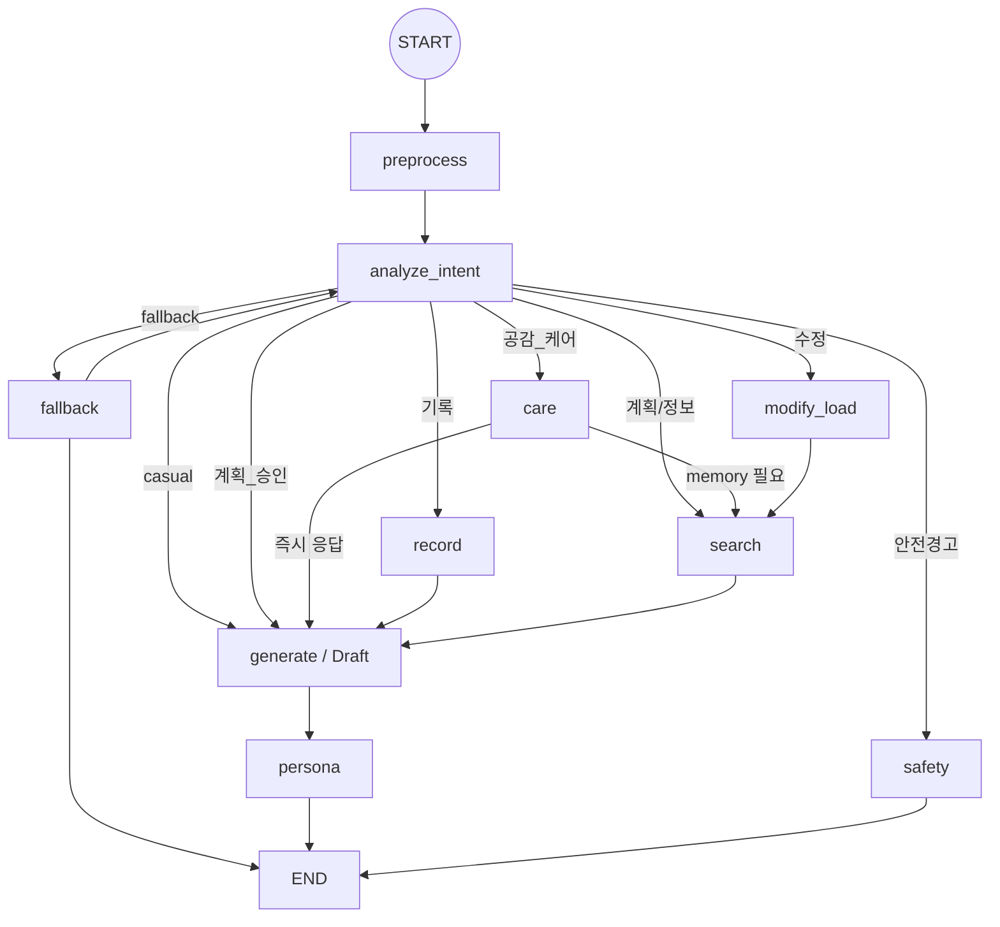

# v2 모델 구조 분석

이 문서는 현재 `ai-model/v2`의 실제 구현을 기준으로, 다른 개발자가 빠르게 구조를 이해할 수 있게 정리한 문서입니다.

## 1. 핵심 요약

v2는 `FastAPI + LangGraph` 기반 대화형 코칭 모델입니다.
핵심 특징은 아래 4가지입니다.

1. `Draft -> Persona` 2단계 생성 구조
2. `계획 제안 -> 사용자 승인 -> WAS 반영` 2-phase flow
3. `selected_ai_persona` 기반 캐릭터 시스템
4. `WAS push event + next-turn refresh` 기반 프로필 동기화

## 2. 전체 그래프

현재 그래프는 아래 흐름으로 구성됩니다.

핵심 파일:
- `app/graph/builder.py`
- `app/graph/nodes/*.py`

## 3. Draft-Persona 계약

예전에는 `draft_text`를 Persona가 통째로 다시 쓰는 구조에 가까웠습니다.
현재는 계약이 더 명확합니다.

### Draft의 책임
`generate` 노드는 말투를 꾸미지 않고, 아래 구조를 만듭니다.

- `core_message`
- `reason_points`
- `suggested_action`
- `safety_notes`
- `approval_question`
- `search_grounding_summary`
- `proposed_plan`
- `proposed_plan_type`

관련 파일:
- `app/schemas/llm_responses.py`
- `app/core/draft_contract.py`
- `app/graph/nodes/generate.py`

### Persona의 책임
`persona` 노드는 위 구조를 받아서:
- 말투
- 세계관
- 캐릭터 분위기
- 문장 연결 방식
만 바꿉니다.

바꾸면 안 되는 것:
- 새 근거 추가
- 새 경고 추가
- 새 플랜 항목 추가
- approval question 삭제/왜곡

관련 파일:
- `app/graph/nodes/persona.py`
- `app/prompts/personas/*.md`

## 4. Persona 시스템

### 사용자 값
사용자 프로필의 공식 persona 필드는 아래입니다.

- `selected_ai_persona`

이 값은 WAS 프로필에서 읽어옵니다.

### Registry 기반 resolve
Persona는 더 이상 파일명 직접 접근이 아니라 registry를 통해 해석됩니다.

구조:
- `app/prompts/personas/registry.json`
- `app/core/persona_registry.py`

resolve 규칙:
1. `selected_ai_persona`가 registry에 있고 active면 사용
2. 없거나 비활성이면 fallback 사용
3. prompt 파일이 없으면 다시 default 사용

### 현재 예시 persona
- `default`
- `spartan`
- `warm`
- `evidence`
- `buddy`

## 5. Prompt Asset 구조

현재는 node별 시스템 지시사항도 코드 밖으로 분리되어 있습니다.

위치:
- `app/prompts/nodes/intent/system.md`
- `app/prompts/nodes/search/eval.md`
- `app/prompts/nodes/search/query_regen.md`
- `app/prompts/nodes/generate/*.md`

이 구조의 장점:
- 프롬프트 수정이 코드 수정과 분리됨
- 다른 개발자가 파일만 읽어도 규칙을 이해 가능
- persona 레이어와 fact 레이어가 분리됨

## 6. WAS 동기화 구조

현재 프로필 동기화는 `pull only`가 아니라 `push event + next-turn refresh`입니다.

흐름:
1. WAS에서 프로필 수정
2. WAS가 `POST /internal/events/profile-updated` 호출
3. FastAPI가 `ProfileSyncTracker`에 version 기록
4. 다음 `/chat` 요청의 `preprocess`가 stale 여부 판단
5. stale이면 `get_user_profile()` 재호출

관련 파일:
- `app/routers/profile_events.py`
- `app/core/profile_sync.py`
- `app/graph/nodes/preprocess.py`
- `docs/was_api_contract.md`

## 7. 승인 저장 구조

계획은 바로 저장되지 않습니다.

흐름:
1. `generate`가 `proposed_plan` 생성
2. 사용자 승인 메시지가 `계획_승인`으로 분류
3. BackgroundTasks에서 WAS 쓰기 실행
4. 성공 시 checkpoint의 pending proposal state 정리

관련 파일:
- `app/graph/nodes/generate.py`
- `app/graph/nodes/was_write.py`
- `app/routers/chat.py`

## 8. 현재 운영상 중요한 규칙

- Persona는 표현만 담당하고 사실을 새로 만들면 안 됨
- `selected_ai_persona`는 WAS 프로필이 source of truth
- profile update 이벤트는 현재 응답을 끊지 않고 다음 턴에서 반영
- `user_profile_override`는 개발/테스트 보조용
- `debug_state`는 development 환경에서만 노출

## 9. 먼저 보면 좋은 파일

처음 파악할 때 추천 순서:

1. `app/graph/builder.py`
2. `app/routers/chat.py`
3. `app/graph/nodes/preprocess.py`
4. `app/graph/nodes/intent.py`
5. `app/graph/nodes/search.py`
6. `app/graph/nodes/generate.py`
7. `app/graph/nodes/persona.py`
8. `docs/was_api_contract.md`
