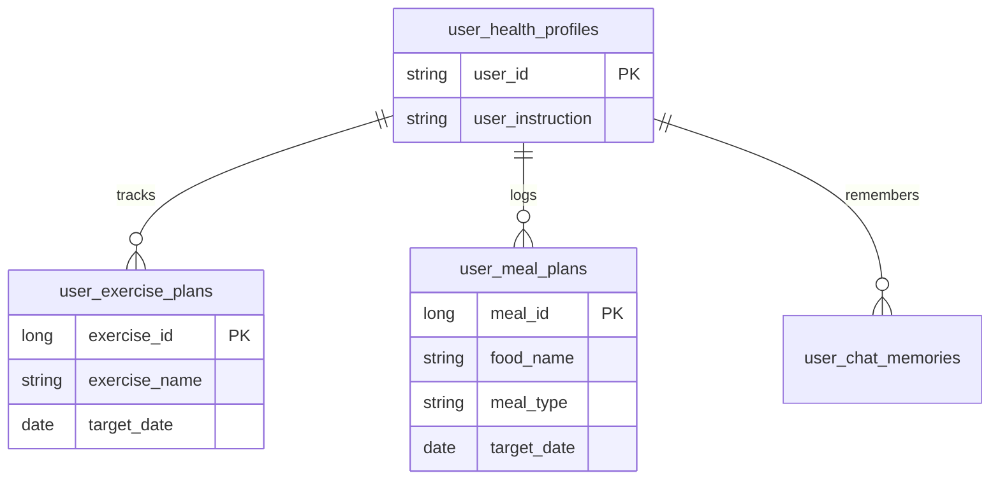

# Database Schema Specification

이 문서는 사용자의 건강 정보, 운동/식단 플랜 및 AI 채팅 기록(Vector DB)을 관리하기 위한 데이터베이스 구조를 정의합니다.

---

## 1. 관계형 데이터베이스 (RDB)

### 1.1 테이블: `user_health_profiles`
사용자의 기본 신체 정보 및 개인화된 AI 지시사항을 저장합니다.

| Column | Type | Constraints | Description |
| :--- | :--- | :--- | :--- |
| **user_id** | VARCHAR(50) | PRIMARY KEY | 사용자 고유 ID |
| **mbti** | CHAR(4) | NULLABLE | MBTI 유형 |
| **gender** | VARCHAR(10) | NOT NULL | 성별 |
| **age** | INTEGER | NOT NULL | 나이 |
| **height** | DECIMAL(5,2) | NOT NULL | 키 (cm) |
| **weight** | DECIMAL(5,2) | NOT NULL | 몸무게 (kg) |
| **bmi** | DECIMAL(4,1) | NOT NULL | 비만 수치 |
| **goal** | VARCHAR(100) | NULLABLE | 건강 관리 목적 |
| **activity_level** | VARCHAR(50) | NULLABLE | 평소 활동량 |
| **medical_history** | TEXT | NULLABLE | 기저질환 (JSON/String) |
| **allergies** | TEXT | NULLABLE | 알러지 목록 (JSON/String) |
| **user_instruction** | TEXT | NULLABLE | **AI용 개인 지시사항** |
| **updated_at** | TIMESTAMP | DEFAULT NOW() | 정보 수정 시각 |

### 1.2 테이블: `user_exercise_plans` (운동 전용)
AI가 추천하거나 사용자가 확정한 **운동** 플랜을 저장합니다.

| Column | Type | Constraints | Description |
| :--- | :--- | :--- | :--- |
| **exercise_id** | BIGINT | PRIMARY KEY, AUTO_INC | 운동 기록 고유 ID |
| **user_id** | VARCHAR(50) | FOREIGN KEY | 사용자 ID |
| **exercise_name** | VARCHAR(100) | NOT NULL | 운동 종류 |
| **sets_reps** | VARCHAR(100) | NULLABLE | 세트/횟수 정보 |
| **burn_calories** | INTEGER | NOT NULL | 소모 칼로리 |
| **target_date** | DATE | NOT NULL | 계획 날짜 |
| **is_completed** | BOOLEAN | DEFAULT FALSE | 수행 완료 여부 |
| **created_at** | TIMESTAMP | DEFAULT NOW() | 생성 시각 |

### 1.3 테이블: `user_meal_plans` (식단 전용)
AI가 추천하거나 사용자가 확정한 **식단** 플랜을 저장합니다.

| Column | Type | Constraints | Description |
| :--- | :--- | :--- | :--- |
| **meal_id** | BIGINT | PRIMARY KEY, AUTO_INC | 식단 기록 고유 ID |
| **user_id** | VARCHAR(50) | FOREIGN KEY | 사용자 ID |
| **food_name** | VARCHAR(100) | NOT NULL | 식품 종류 |
| **meal_type** | VARCHAR(20) | NOT NULL | 아침/점심/저녁/간식 |
| **calories** | INTEGER | NOT NULL | 섭취 칼로리 |
| **target_date** | DATE | NOT NULL | 계획 날짜 |
| **created_at** | TIMESTAMP | DEFAULT NOW() | 생성 시각 |

---

## 2. 벡터 데이터베이스 (Vector DB)

### 2.1 컬렉션: `user_chat_memories`

| Field | Type | Description |
| :--- | :--- | :--- |
| **id** | UUID | 고유 식별자 |
| **vector** | LIST(FLOAT) | 임베딩 값 |
| **user_id** | STRING | (Metadata) 사용자 식별자 |
| **summary** | STRING | (Metadata) Gemini 요약 내용 |
| **timestamp** | TIMESTAMP | (Metadata) 기록 시각 |

---

## 3. 데이터 구조 (ERD)

