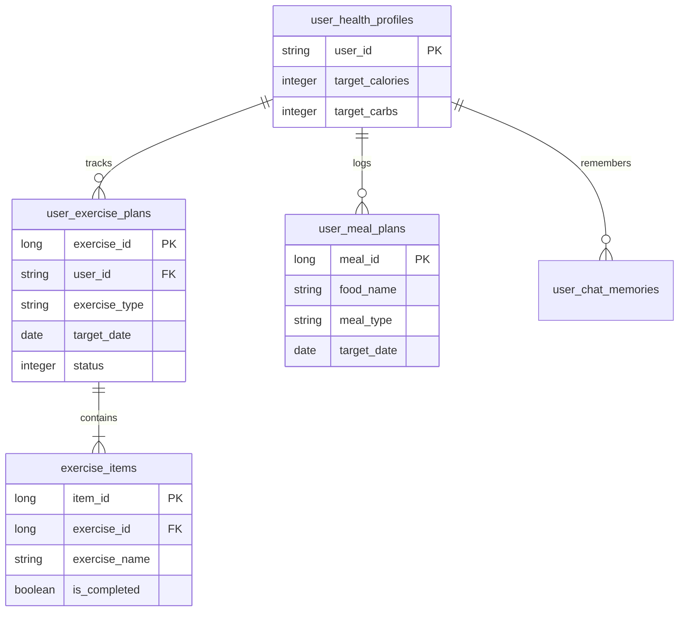

# [Specification] 추천 항목 확정(좋아요) API 명세 (sequence_2)

이 문서는 사용자가 추천받은 항목을 '좋아요(채택)'하여 자신의 캘린더에 확정 등록하는 프로세스에 대한 규격을 정의합니다.
이 과정은 **AI(FastAPI)가 개입하지 않는** 순수 비즈니스 로직입니다.

## 1. 추천 항목 확정 (Confirmation)

### 1.1 Front → WAS 요청 (POST /confirm-recommendation)
사용자가 선택한 추천 항목 정보를 서버에 저장 요청합니다.

```json
{
  "user_id": "string",
  "item_type": "string",       // "exercise" 또는 "meal"
  "item_id": "string",         // 추천된 항목의 고유 ID (있을 경우)
  "item_details": {
    "name": "string",          // 운동/식단 이름
    "calories": "number",      // (운동 시 소모 / 식단 시 섭취) 칼로리
    "date": "YYYY-MM-DD",      // 등록할 날짜
    "time_slot": "string"      // (식단 시) 아침, 점심, 저녁 등
  }
}
```

### 1.2 WAS → Front 응답
성공적으로 DB에 저장되었음을 알립니다.

```json
{
  "status": "success",
  "message": "성공적으로 저장되었습니다.",
  "data": {
    "entry_id": "string"       // DB에 생성된 고유 기록 ID
  }
}
```

---

## 2. 데이터베이스 처리 (WAS Internal)
- **FastAPI 호출 없음**: AI 분석 단계가 아니므로 WAS에서 직접 DB 작업을 수행합니다.
- **DB 테이블**: 사용자의 `user_daily_plans` 또는 `user_meal_logs` 테이블에 데이터를 추가합니다.
- **성공 후 처리**: 프론트엔드에서는 응답을 받은 후 즉시 사용자 **캘린더**에 해당 항목을 자동으로 렌더링하고 사용자에게 알림을 표시합니다.

---

# Database Schema Specification

이 문서는 사용자의 건강 정보, 운동/식단 플랜 및 AI 채팅 기록(Vector DB)을 관리하기 위한 데이터베이스 구조를 정의합니다.

---

## 1. 관계형 데이터베이스 (RDB)

### 1.1 테이블: `user_health_profiles`
사용자의 기본 신체 정보 및 개인화된 AI 지시사항을 저장합니다.

| Column | Type | Constraints | Description |
| :--- | :--- | :--- | :--- |
| **user_id** | VARCHAR(50) | PRIMARY KEY | 사용자 고유 ID |
| **mbti** | CHAR(4) | NULLABLE | MBTI 유형 |
| **gender** | VARCHAR(10) | NOT NULL | 성별 |
| **age** | INTEGER | NOT NULL | 나이 |
| **height** | DECIMAL(5,2) | NOT NULL | 키 (cm) |
| **weight** | DECIMAL(5,2) | NOT NULL | 몸무게 (kg) |
| **bmi** | DECIMAL(4,1) | NOT NULL | 비만 수치 |
| **goal** | VARCHAR(100) | NULLABLE | 건강 관리 목적 |
| **activity_level** | VARCHAR(50) | NULLABLE | 평소 활동량 |
| **medical_history** | TEXT | NULLABLE | 기저질환 (JSON/String) |
| **allergies** | TEXT | NULLABLE | 알러지 목록 (JSON/String) |
| **target_calories** | INTEGER | DEFAULT 2000 | 하루 목표 섭취 칼로리 |
| **target_carbs** | INTEGER | DEFAULT 250 | 목표 탄수화물 (g) |
| **target_protein** | INTEGER | DEFAULT 80 | 목표 단백질 (g) |
| **target_fat** | INTEGER | DEFAULT 50 | 목표 지방 (g) |
| **updated_at** | TIMESTAMP | DEFAULT NOW() | 정보 수정 시각 |

### 1.2 테이블: `user_exercise_plans` (운동 유형)
AI가 추천하거나 사용자가 확정한 **운동 유형** 플랜을 저장합니다.

| Column | Type | Constraints | Description |
| :--- | :--- | :--- | :--- |
| **exercise_id** | BIGINT | PRIMARY KEY, AUTO_INC | 운동 기록 고유 ID |
| **user_id** | VARCHAR(50) | FOREIGN KEY | 사용자 ID |
| **exercise_type** | TEXT | NOT NULL | 운동 유형 |
| **target_date** | DATE | NOT NULL | 계획 날짜 |
| **status** | INTEGER | DEFAULT 0 | 0(실패/미완), 1(성공), 2(부분 성공) |
| **total_calories** | INTEGER | NOT NULL | 해당 세션 전체 예상 소모 칼로리 |
| **created_at** | TIMESTAMP | DEFAULT NOW() | 생성 시각 |

### 1.3 테이블: `exercise_items` (운동 요소)
AI가 추천하거나 사용자가 확정한 **운동 요소** 플랜을 저장합니다.

| Column | Type | Constraints | Description |
| :--- | :--- | :--- | :--- |

| **item_id** | BIGINT | PRIMARY KEY, AUTO_INC | 운동 요소 고유 ID |
| **exercise_id** | BIGINT | FOREIGN KEY | 운동 기록 고유 ID |
| **exercise_name** | TEXT | NOT NULL | 운동 이름 |
| **is_completed** | BOOLEAN | DEFAULT FALSE | 수행 완료 여부 |
| **calories** | INTEGER | NOT NULL | 소모 칼로리 |
| **created_at** | TIMESTAMP | DEFAULT NOW() | 생성 시각 |

### 1.4 테이블: `user_meal_plans` (식단 전용)
AI가 추천하거나 사용자가 확정한 **식단** 플랜을 저장합니다.

| Column | Type | Constraints | Description |
| :--- | :--- | :--- | :--- |
| **meal_id** | BIGINT | PRIMARY KEY, AUTO_INC | 식단 기록 고유 ID |
| **user_id** | VARCHAR(50) | FOREIGN KEY | 사용자 ID |
| **food_name** | VARCHAR(100) | NOT NULL | 식품 종류 |
| **meal_type** | VARCHAR(20) | NOT NULL | 아침/점심/저녁/간식 |
| **calories** | INTEGER | NOT NULL | 섭취 칼로리 |
| **target_date** | DATE | NOT NULL | 계획 날짜 |
| **created_at** | TIMESTAMP | DEFAULT NOW() | 생성 시각 |

---

## 2. 벡터 데이터베이스 (Vector DB)

### 2.1 컬렉션: `user_chat_memories`

| Field | Type | Description |
| :--- | :--- | :--- |
| **id** | UUID | 고유 식별자 |
| **vector** | LIST(FLOAT) | 임베딩 값 |
| **user_id** | STRING | (Metadata) 사용자 식별자 |
| **summary** | STRING | (Metadata) Gemini 요약 내용 |
| **timestamp** | TIMESTAMP | (Metadata) 기록 시각 |

---

## 3. 데이터 구조 (ERD)


