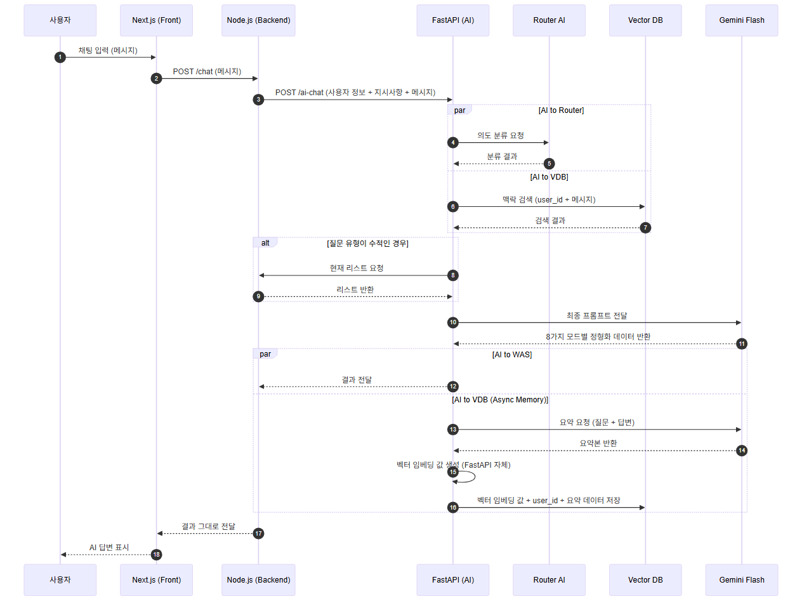

# Sequence_3: AI 채팅 (단순대화, 플랜/식단 추천/수정, DB 수정)

이 문서는 사용자와 AI 간의 채팅 인터랙션 및 내부 라우팅, 데이터 연동 프로세스를 정의합니다.

## 1. 시퀀스 다이어그램 (Sequence Diagram)



---

## 2. 주요 프로세스 상세

### 2.1 AI 채팅 및 의도 분류 (Router & Vector DB)
1. **사용자 → Front → WAS**: 사용자가 채팅을 입력하면 WAS를 거쳐 AI(FastAPI)로 전달됩니다.
2. **AI (Parallel Request)**:
    - **Router AI**: 라우터 시스템 지침서와 사용자 메시지를 대조하여 8가지 모드 중 하나로 의도를 분류합니다.
    - **Vector DB**: `user_id`와 사용자 메시지를 바탕으로 이전 대화 기록 및 컨텍스트를 검색합니다.
3. **조건부 검색 (수정 요청 시)**: 라우터 분류 결과가 '운동 수정' 또는 '식단 수정'일 경우, Vector DB에 **현재 운동/식단 리스트**를 추가로 요청하여 확보합니다.

### 2.2 답변 생성 및 비동기 요약 저장
- **LLM (Gemini Flash) 호출**: 
    - 입력: `사용자 메시지 + 사용자 지시사항 + 시스템 지시사항 + 사용자 정보 + 이전 대화 기록 + 라우터 결과값 [+ 현재 리스트(수정 시)]`
    - 출력: 각 모드별 정형화된 JSON 데이터
- **결과 반환 (Response Handling)**:
    - **6번(사용자 DB 수정)**: 분석 결과 중 사용자가 볼 수 있는 **답변 메시지**만 프론트로 전달합니다.
    - **그 외 모드**: 생성된 모든 데이터(메시지 + 추천/수정 상세 정보)를 프론트로 전달합니다.
- **Background Sync**: 답변 전송 후 비동기로 Gemini를 통해 문답을 요약하여 다음 대화를 위해 Vector DB에 저장합니다.

---

## 3. AI API 명세 (JSON 규격)

### 3.1 WAS → AI 요청 (POST /ai-chat)
```json
{
  "user_id": "string",
  "user_profile": {
    "gender": "string",
    "age": "number",
    "bmi": "number",
    "goal": "string",
    "target_calories": "number",
    "target_carbs": "number",
    "target_protein": "number",
    "target_fat": "number"
  },
  "user_message": "string"      // 사용자가 입력한 채팅 메시지
}
```

### 3.2 AI → WAS 응답 (모드별 상세)
Gemini Flash가 생성한 데이터가 `mode`에 따라 다르게 반환됩니다.

```json
{
  "status": "success",
  "mode": "number", // 1(단순대화), 2(플랜작성), 3(플랜수정), 4(식단작성), 5(식단수정), 6(DB수정) ...
  "data": {
    "message": "string",       // 사용자에게 보여줄 피드백 메시지
    "plan": {                  // 모드 2, 3, 4, 5인 경우에만 포함
      "date": "string",
      "items": [
        {
          "type": "string",    // 운동 종류 또는 식품 종류
          "detail": "string",  // 세부 항목 또는 시간(아/점/저)
          "value": "string"    // 횟수 또는 수량
        }
      ]
    },
    "db_update": {             // 모드 6인 경우 업데이트할 항목 정보 (사용자 비노출)
      "field": "string",
      "new_value": "any"
    }
  }
}
```

> [!NOTE]
> 6번 모드의 경우 프론트엔드에서는 `data.message`만 사용자에게 노출합니다.
