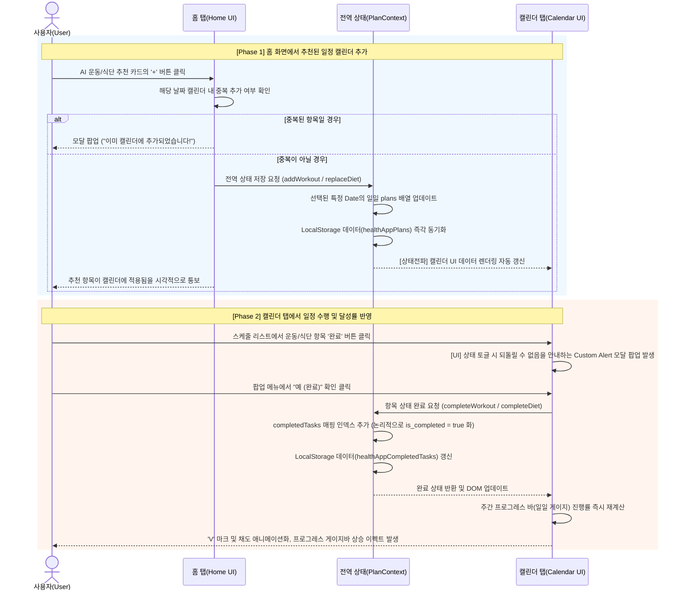

# 프로젝트 프론트엔드 데이터 구조 및 시퀀스 명세서

이 문서는 최근 리팩토링된 프론트엔드의 전역 상태(Context API) 구조와 홈 화면 ↔ 캘린더 연동 흐름을 명세한 문서입니다.

## 1. 전역 시스템 데이터 포맷 (Data Format)

### 1.1 사용자 건강 프로필 (User Profile)
의료 정보 관리 및 AI 프롬프팅을 위한 사용자 정보 데이터 정의.

| 필드명 | 타입 | 설명 |
| :--- | :--- | :--- |
| `name` | String | 사용자 이름 |
| `goal` | String | 건강/운동 목표 (예: "다이어트", "근력 향상", "건강 유지") |
| `activity_level` | String | 평소 활동량 (예: "거의 없음", "가벼운 활동", "보통", "격렬한 활동") |
| `medical_history` | **String[]** | 기저질환 목록 (예: `["고혈압", "당뇨"]`) |
| `allergies` | **String[]** | 알러지 목록 (예: `["유제품", "견과류"]`) |
| `gender` | String | 성별 ("male", "female") |
| `age` | Number | 나이 |
| `height`, `weight` | Number | 체격 정보 |
| `bmi` | Number | WAS(Backend)에서 계산되어 반환되는 비만수치 정보 |

### 1.2 홈 화면 ↔ 캘린더 연동 일정 객체 (Plan Context)
사용자가 홈 화면에서 AI 추천을 받아 `+` 버튼으로 캘린더 전역 상태에 일정을 추가할 때 사용되는 데이터 구조입니다.

**💪 운동 (WorkoutItem) DTO**
| 필드명 | 타입 | 설명 |
| :--- | :--- | :--- |
| `title` | String | 운동명 (예: "푸시업") |
| `time` | String | 예상 소모 시간 (예: "15분") |
| `level` | String | 난이도 (예: "초급") |
| `calories` | String | 소모 칼로리 (예: "150 kcal") |
| `color` | String | UI 렌더링용 그라데이션 색상 클래스 |
| `type` | String | 운동 카테고리 (상체운동, 하체운동, 유산소 등) |
| `is_completed` | **Boolean** | **(신규) 해당 운동 완수 여부** |

**🥗 식단 (DietItem) DTO**
| 필드명 | 타입 | 설명 |
| :--- | :--- | :--- |
| `type` | String | 식사 타입 카테고리 ("아침", "점심", "저녁") |
| `name` | String | 식단 이름 (예: "닭가슴살 샐러드") |
| `desc` | String | 식단 메뉴의 효과 혹은 설명 (예: "단백질 보충") |
| `kcal` | String | 섭취 예상 칼로리 (예: "450 kcal") |
| `is_completed` | **Boolean** | **(신규) 해당 식사 달성 여부** |

> **Context 상태 관리 참고**
> 현재 프론트엔드 React Context(`PlanContext.tsx`) 내부에서는 달성된 일정의 리스트 관리 시, 각각을 `completedTasks`라는 Record 매핑 객체의 인덱스 값으로 추적하는 로직으로 구성되었습니다. 이는 DB와 실제 연동할 때나 논리적으로 도식화할 때 배열 내 객체의 `is_completed: boolean` 값으로 즉시 치환 가능합니다.

---

## 2. 홈 화면 ↔ 캘린더 연동 및 달성 흐름 (Sequence Diagram)

아래 시퀀스 다이어그램은 1) 유저가 홈 탭에서 AI 추천 항목의 **`+` 버튼을 클릭**하여 캘린더 전역 상태에 일정을 추가하고, 2) 이후 캘린더 탭으로 넘어가서 **'완료' 버튼**을 눌러 진행률 게이지를 업데이트하는 전체 과정을 나타냅니다.

