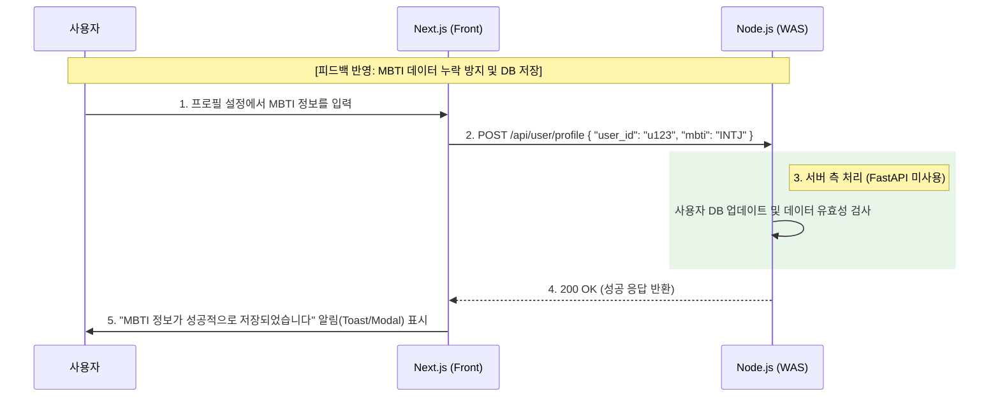

# Sequence_0: MBTI 데이터 누락 방지 및 DB 저장

이 문서는 사용자의 MBTI 정보를 입력받아 WAS DB에 저장하는 프로세스를 정의합니다.

## 시퀀스 다이어그램 (Mermaid)

```mermaid
sequenceDiagram
    participant user as 사용자
    participant front as Next.js (Front)
    participant was as Node.js (WAS)

    Note over user, was: [피드백 반영: MBTI 데이터 누락 방지 및 DB 저장]

    user->>front: 1. 프로필 설정에서 MBTI 정보를 입력
    front->>was: 2. POST /api/user/profile { "user_id": "u123", "mbti": "INTJ" }
    
    rect rgb(232, 245, 233)
        Note right of was: 3. 서버 측 처리 (FastAPI 미사용)
        was->>was: 사용자 DB 업데이트 및 데이터 유효성 검사
    end

    was-->>front: 4. 200 OK (성공 응답 반환)
    front->>user: 5. "MBTI 정보가 성공적으로 저장되었습니다" 알림(Toast/Modal) 표시
```
