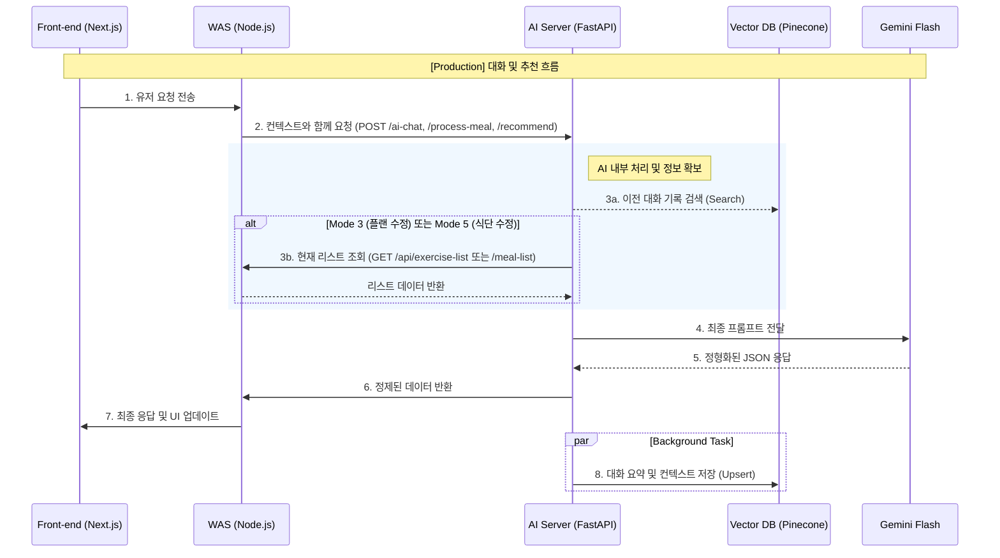

# Sequence_1: 대화 및 추천 전역 흐름 (Overall Flow)

이 문서는 사용자 요청에 따른 전역적인 대화 및 추천 프로세스를 정의합니다.

## 시퀀스 다이어그램 (Mermaid)

```mermaid
sequenceDiagram
    participant FE as Front-end (Next.js)
    participant BE as WAS (Node.js)
    participant AI as AI Server (FastAPI)
    participant VDB as Vector DB (Pinecone)
    participant LLM as Gemini Flash

    Note over FE, LLM: [Production] 대화 및 추천 흐름

    FE->>BE: 1. 유저 요청 전송
    BE->>AI: 2. 컨텍스트와 함께 요청 (POST /ai-chat, /process-meal, /recommend)
    
    rect rgb(240, 248, 255)
        Note right of AI: AI 내부 처리 및 정보 확보
        
        AI-->>VDB: 3a. 이전 대화 기록 검색 (Search)
        
        alt Mode 3 (플랜 수정) 또는 Mode 5 (식단 수정)
            AI->>BE: 3b. 현재 리스트 조회 (GET /api/exercise-list 또는 /meal-list)
            BE-->>AI: 리스트 데이터 반환
        end
    end

    AI->>LLM: 4. 최종 프롬프트 전달
    LLM-->>AI: 5. 정형화된 JSON 응답
    
    AI->>BE: 6. 정제된 데이터 반환
    BE->>FE: 7. 최종 응답 및 UI 업데이트
    
    par Background Task
        AI->>VDB: 8. 대화 요약 및 컨텍스트 저장 (Upsert)
    end
```
