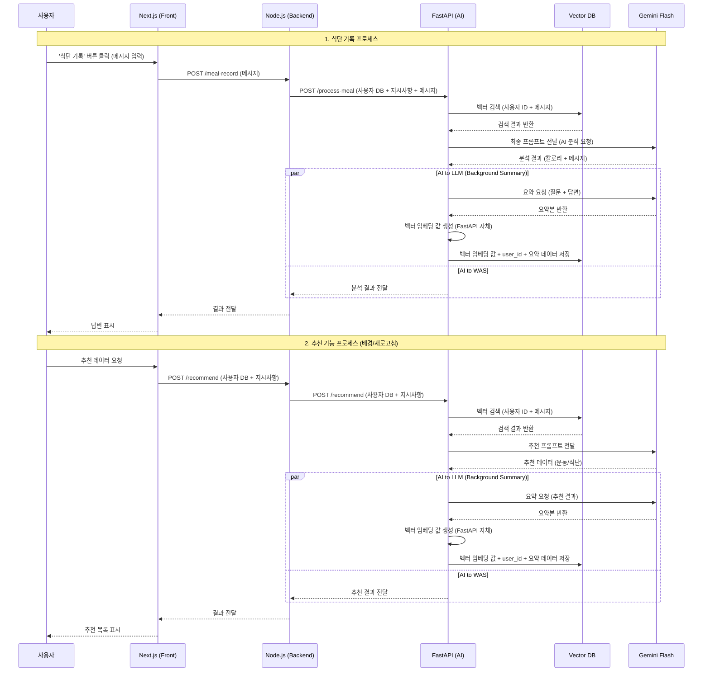

# Sequence_1_ai: 식단 기록 및 추천 프로세스 상세

이 문서는 식단 기록 분석 및 운동/식단 추천의 상세 AI 프로세스를 정의합니다.

## 시퀀스 다이어그램 (Mermaid)

```mermaid
sequenceDiagram
    participant user as 사용자
    participant front as Next.js (Front)
    participant back as Node.js (Backend)
    participant ai as FastAPI (AI)
    participant vdb as Vector DB
    participant gemini as Gemini Flash

    Note over user, gemini: 1. 식단 기록 프로세스

    user->>front: '식단 기록' 버튼 클릭 (메시지 입력)
    front->>back: POST /meal-record (메시지)
    back->>ai: POST /process-meal (사용자 DB + 지시사항 + 메시지)

    ai->>vdb: 벡터 검색 (사용자 ID + 메시지)
    vdb-->>ai: 검색 결과 반환

    ai->>gemini: 최종 프롬프트 전달 (AI 분석 요청)
    gemini-->>ai: 분석 결과 (칼로리 + 메시지)

    par AI to LLM (Background Summary)
        ai->>gemini: 요약 요청 (질문 + 답변)
        gemini-->>ai: 요약본 반환
        ai->>ai: 벡터 임베딩 값 생성 (FastAPI 자체)
        ai->>vdb: 벡터 임베딩 값 + user_id + 요약 데이터 저장
    and AI to WAS
        ai-->>back: 분석 결과 전달
    end

    back-->>front: 결과 전달
    front-->>user: 답변 표시

    Note over user, gemini: 2. 추천 기능 프로세스 (배경/새로고침)

    user->>front: 추천 데이터 요청
    front->>back: POST /recommend (사용자 DB + 지시사항)
    back->>ai: POST /recommend (사용자 DB + 지시사항)

    ai->>vdb: 벡터 검색 (사용자 ID + 메시지)
    vdb-->>ai: 검색 결과 반환

    ai->>gemini: 추천 프롬프트 전달
    gemini-->>ai: 추천 데이터 (운동/식단)

    par AI to LLM (Background Summary)
        ai->>gemini: 요약 요청 (추천 결과)
        gemini-->>ai: 요약본 반환
        ai->>ai: 벡터 임베딩 값 생성 (FastAPI 자체)
        ai->>vdb: 벡터 임베딩 값 + user_id + 요약 데이터 저장
    and AI to WAS
        ai-->>back: 추천 결과 전달
    end

    back-->>front: 결과 전달
    front-->>user: 추천 목록 표시
```
