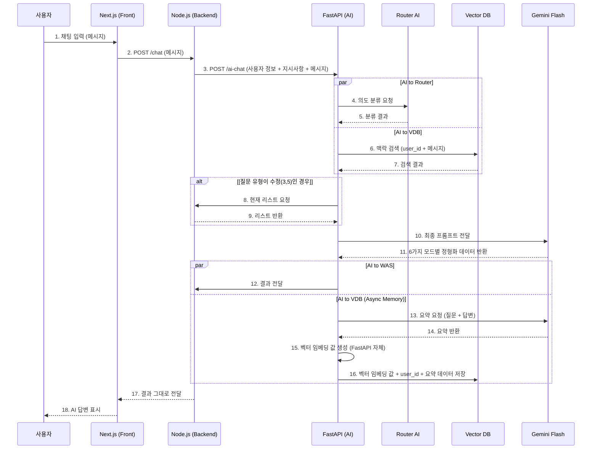

# Sequence_2_ai: 상세 AI 통신 흐름 (Detailed Flow)

이 문서는 AI 서버 내부의 라우팅, 정보 조회 및 응답 생성의 상세 흐름을 정의합니다.

## 시퀀스 다이어그램 (Mermaid)

```mermaid
sequenceDiagram
    participant user as 사용자
    participant front as Next.js (Front)
    participant back as Node.js (Backend)
    participant ai as FastAPI (AI)
    participant router as Router AI
    participant vdb as Vector DB
    participant gemini as Gemini Flash

    user->>front: 1. 채팅 입력 (메시지)
    front->>back: 2. POST /chat (메시지)
    back->>ai: 3. POST /ai-chat (사용자 정보 + 지시사항 + 메시지)

    par AI to Router
        ai->>router: 4. 의도 분류 요청
        router-->>ai: 5. 분류 결과
    and AI to VDB
        ai->>vdb: 6. 맥락 검색 (user_id + 메시지)
        vdb-->>ai: 7. 검색 결과
    end

    alt [질문 유형이 수정(3,5)인 경우]
        ai->>back: 8. 현재 리스트 요청
        back-->>ai: 9. 리스트 반환
    end

    ai->>gemini: 10. 최종 프롬프트 전달
    gemini-->>ai: 11. 6가지 모드별 정형화 데이터 반환

    par AI to WAS
        ai->>back: 12. 결과 전달
    and AI to VDB (Async Memory)
        ai->>gemini: 13. 요약 요청 (질문 + 답변)
        gemini-->>ai: 14. 요약 반환
        ai->>ai: 15. 벡터 임베딩 값 생성 (FastAPI 자체)
        ai->>vdb: 16. 벡터 임베딩 값 + user_id + 요약 데이터 저장
    end

    back-->>front: 17. 결과 그대로 전달
    front-->>user: 18. AI 답변 표시
```
