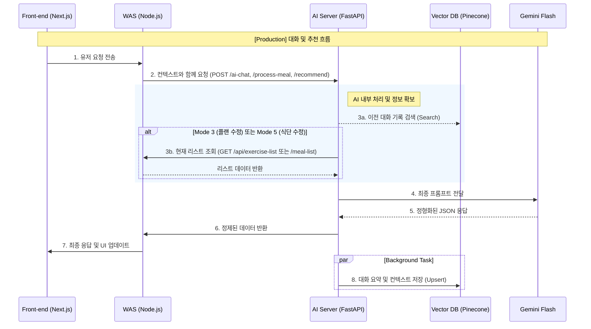

# AI Sequence Diagrams

이 문서는 WAS와 FastAPI 간의 상호작용을 Mermaid 시퀀스 다이어그램으로 시각화한 문서입니다.

## 1. 전역 AI 통신 구조 (Overall Flow)

전체적인 대화 및 추천 프로세스 흐름은 아래와 같습니다.

## 2. 상세 시퀀스 다이어그램 목록

각 시퀀스별 상세 내용은 아래 개별 문서에서 확인할 수 있습니다.

- [Sequence_0: MBTI 설정](sequence_0.md)
- [Sequence_1: 전역 흐름](sequence_1.md)
- [Sequence_1_ai: 식단/추천 상세](sequence_1_ai.md)
- [Sequence_2_ai: 상세 AI 통신](sequence_2_ai.md)
